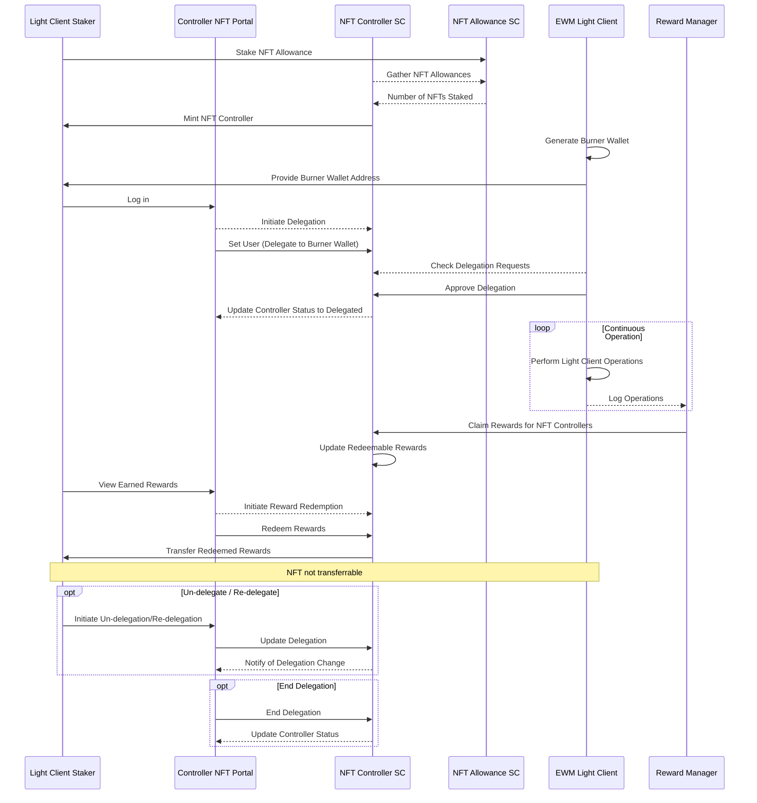

# ewm-light-contracts

EWM light clients operator-controller NFT contracts, enabling NFT claim/mint, LC registration/delegation, rewards calculation and redemption on any EVM chain based on the [ERC4907](https://eips.ethereum.org/EIPS/eip-4907) non-transferrable "rental-nft" standard.

Main components -

1. [EwmNftController](./contracts/EwmNftController.sol)
1. [EwmNftClaim](./contracts/EwmNftClaim.sol)
1. [EwmNftAllowance](./contracts/EwmNftAllowance.sol)
1. [IERC4907](./contracts/IERC4907.sol)

## Operation



## Compile Contracts & Run Tests

Clone repo, use stable node version (node v20.10.0 (npm v10.2.3)), ensure `.envrc.local` is present with the following, install dependencies and run unit and integration tests.

```bash
# Clone the repository
git clone git@github.com:covalenthq/ewm-lc-contracts.git

# Change to the project directory
cd ewm-lc-contracts

# Use the stable version of Node.js
nvm use stable

# Create the .envrc file
echo 'export ERIGON_NODE="<ethereum-erigon-node-url>"' > .envrc

# Allow direnv to load the .envrc file
direnv allow .

# Install dependencies
npm install

# Run test coverage
npm run coverage
```

You should get something like this -

<!-- prettier-ignore-start -->
```markdown
  267 passing (2m)

-----------------------|----------|----------|----------|----------|----------------|
File                   |  % Stmts | % Branch |  % Funcs |  % Lines |Uncovered Lines |
-----------------------|----------|----------|----------|----------|----------------|
 contracts/            |      100 |    86.94 |      100 |    99.64 |                |
  EwmNftAllowance.sol  |      100 |    78.33 |      100 |      100 |                |
  EwmNftClaim.sol      |      100 |     87.5 |      100 |    98.41 |             74 |
  EwmNftController.sol |      100 |    91.23 |      100 |      100 |                |
 contracts/interfaces/ |      100 |      100 |      100 |      100 |                |
  IERC4907.sol         |      100 |      100 |      100 |      100 |                |
-----------------------|----------|----------|----------|----------|----------------|
All files              |      100 |    86.94 |      100 |    99.64 |                |
-----------------------|----------|----------|----------|----------|----------------|
```
<!-- prettier-ignore-end -->

## Deployment

This deployment story outlines the process of setting up the entire NFT ecosystem, from initial contract deployment to user management and reward distribution. It ensures that all necessary configurations are in place, tokens are distributed, and the system is ready for user interaction and ongoing management.

1. Initial Contract Deployment:

   - Deploy NFT Controller
   - Deploy NFT Claim
   - Deploy NFT Allowance

2. Configuration and Setup:

   - Deposit reward tokens to the Controller
   - Set Claim Admin address
   - Configure Claim Allowance Contracts Array
   - Unpause the Claim Contract
   - Set Allowance Whitelist Merkle Root and Integer Allocation Boolean

3. Metadata and Token Distribution:

   - Retrieve and verify metadata for all contracts
   - Distribute CXT Faucet Tokens to participants

4. Controller and Whitelist Management:

   - Set Controller Minter Admin (to Claim Contract), Transfer Whitelist (to Claim Contract), and Transfer Time
   - Set Nft Expiry Ranges
   - Verify updated metadata

5. NFT Allocation and Claiming:

   - Set NFT Token base URLs
   - Execute Whitelisted Allocation for eligible participants
   - Perform Admin Batch Claim for all eligible NFTs
   - Pause Claim Contract

6. User Management and Rewards:

   - Set User Delegates and Expiration times for NFTs
   - Distribute rewards to NFT holders

7. Reward Redemption and Stake Release:
   - Allow NFT holders to redeem their rewards
   - Release stakes for expired NFTs

```bash
# deploy all the necessary contracts
npx hardhat run scripts/deployCxtTokenFaucet.js --network ${network}
npx hardhat run scripts/deployNftController.js --network ${network}
npx hardhat run scripts/deployNftClaim.js --network ${network}
npx hardhat run scripts/deployNftAllowance.js --network ${network}

# set contract metadata for use
npx hardhat run scripts/depositControllerRewardTokens.js --network ${network}
npx hardhat run scripts/setControllerNftExpiryRange.js --network ${network}
npx hardhat run scripts/setControllerNftBaseUrl.js --network ${network}

## set contracts for participation
npx hardhat run scripts/setClaimAllowanceContractsArray.js --network ${network}
npx hardhat run scripts/unpauseClaimContract.js --network ${network}
npx hardhat run scripts/distributeCxtFaucetToken.js --network ${network}
npx hardhat run scripts/setAllowanceWhitelistRootIntegerAllocation.js --network ${network}

# extras participants fns for staking and operations
npx hardhat run scripts/executeWhitelistedAllowance.js --network ${network}

## set for nft mint distribution
npx hardhat run scripts/setControllerMinterAdmin.js --network ${network}
npx hardhat run scripts/setControllerTransferWhitelistAndTime.js --network ${network}
npx hardhat run scripts/executeAdminBatchClaimAll.js --network ${network} or npx hardhat run scripts/executeAdminBatchClaimArray.js --network ${network}
npx hardhat run scripts/pauseClaimContract.js --network ${network}

## reward nft holders
npx hardhat run scripts/executeSetUserDelegateAndExpires.js --network ${network}
npx hardhat run scripts/rewardNftHolders.js --network ${network}
npx hardhat run scripts/redeemAllNftRewards.js --network ${network}

## post nfts expiry participants fns
npx hardhat run scripts/releaseStakeForExpiredNfts.js --network ${network}

# extras admin fns
npx hardhat run scripts/setClaimAdmin.js --network ${network}
npx hardhat run scripts/getAllMetadata.js --network ${network}
npx hardhat run scripts/setAllowanceExpiryTime.js --network ${network}
```
